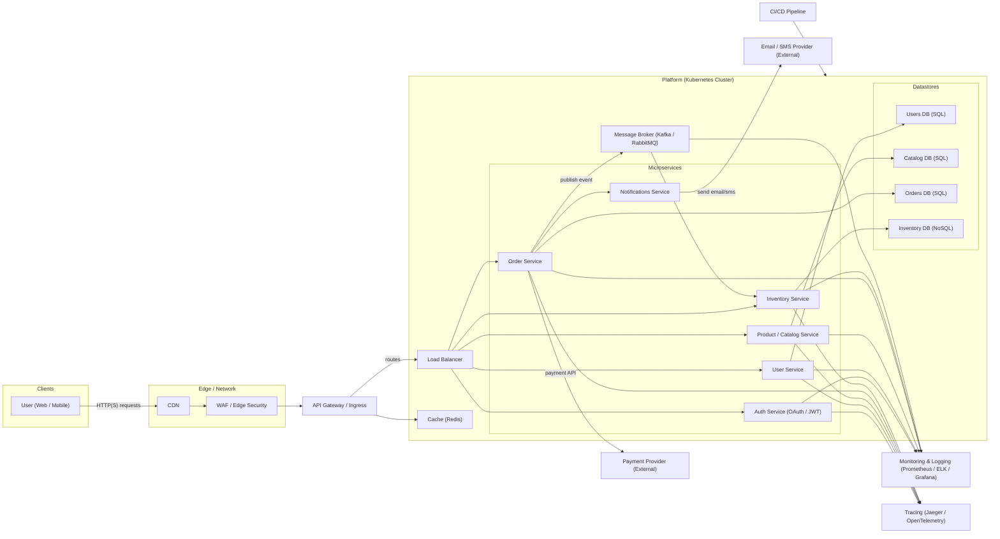

# Architecture Overview

Corrigi o erro de renderização: o problema vinha do rótulo da seta contendo parênteses `HTTP(S)` — o parser do Mermaid pode interpretar parênteses especiais dentro de rótulos se não estiverem entre aspas. A correção foi envolver o texto do rótulo entre aspas: `"HTTP(S) requests"`. Em geral, sempre que um label de seta contiver parênteses, barras ou caracteres especiais, coloque-o entre aspas.

Abaixo está o diagrama Mermaid corrigido.

O que corrigi
- Coloquei o label da seta com parênteses entre aspas: `"HTTP(S) requests"`.

Boas práticas para evitar erros similares
- Ponha labels de setas entre aspas sempre que tiverem parênteses, barras, dois-pontos ou outros caracteres especiais.
- Teste o diagrama em https://mermaid.live/ ou no preview do GitHub para validar.
- Se aparecer outro erro, copie a mensagem e eu ajusto o diagrama.

Quer que eu gere uma versão com rótulos em português ou exporte o diagrama para SVG/PNG?
